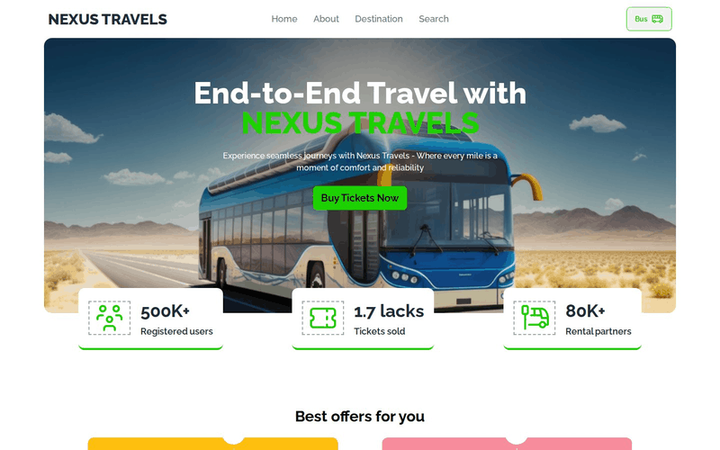
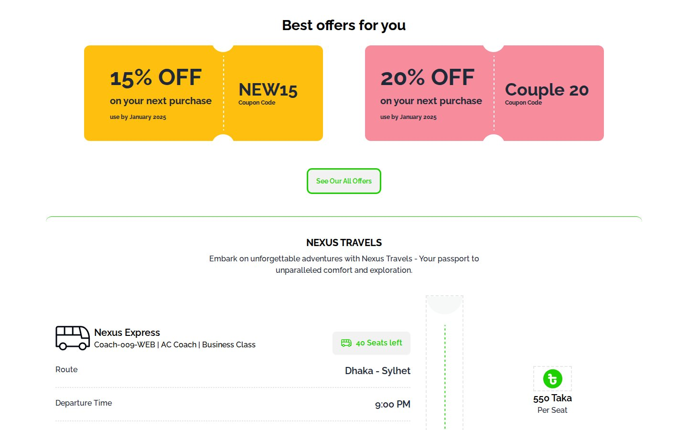
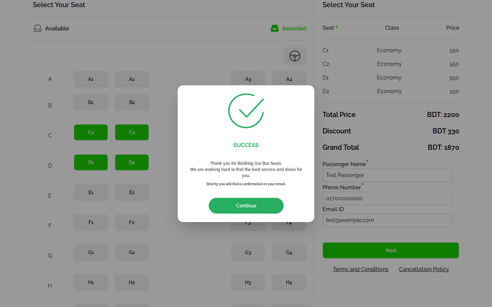

# NEXUS Travels

A bus ticket booking page for a Dhaka to Sylhet coach: pick up to four seats, apply a coupon and confirm, all in plain JavaScript.

**Live site:** <https://shayan-abrar.github.io/NEXUS-TRAVELS-TICKETING-with-js/>

<p align="center">
  
</p>

<table>
  <tr>
    <td align="center" width="25%"><a href="screenshots/home.jpg"></a><br><sub><b>Home</b> · hero and stats</sub></td>
    <td align="center" width="25%"><a href="screenshots/offers-trip.jpg"></a><br><sub><b>Offers</b> · trip details</sub></td>
    <td align="center" width="25%"><a href="screenshots/booking.png"></a><br><sub><b>Booking</b> · 4 seats, NEW15</sub></td>
    <td align="center" width="25%"><a href="screenshots/success.png"></a><br><sub><b>Confirmation</b></sub></td>
  </tr>
</table>

Booking a bus seat online comes down to a few steps: check the trip, pick seats, see the price and confirm. This page runs that whole flow in the browser with one script. Every seat click updates the seat count, the fare summary and the totals, and simple checks decide when the coupon and **Next** buttons unlock, which makes it a compact example of managing UI state with plain DOM code.

## Quick Start

```bash
git clone https://github.com/SHAYAN-ABRAR/NEXUS-TRAVELS-TICKETING-with-js.git
cd NEXUS-TRAVELS-TICKETING-with-js
python3 -m http.server 8000
```

Open <http://localhost:8000>. On Windows, use `python` instead of `python3`. Opening `index.html` directly in a browser works too. Tailwind CSS, DaisyUI and the Raleway font load from the internet.

## Features

- **Landing page:** a hero whose **Buy Tickets Now** button jumps to the seat map, three stat cards and two coupon offer cards.
- **Trip card:** the Nexus Express coach, the Dhaka to Sylhet route, a 9:00 PM departure, boarding and dropping points and a 550-taka fare per seat.
- **Seat map:** 40 seats in rows A to J. A selected seat turns green, can't be clicked again and lowers the "Seats left" count.
- **Four-seat limit:** trying a fifth seat shows the alert "You can only select four seats and not more".
- **Fare summary:** each seat is listed with its class and fare, and **Total Price** and **Grand Total** update on every click.
- **Coupons:** **Apply** unlocks once four seats are selected. `NEW15` takes 15% off and `Couple 20` takes 20% off. Any other code shows "Invalid Coupon". A valid code adds a discount row and hides the coupon field.
- **Confirmation:** after a seat is selected, typing a phone number enables **Next**, which opens a success message in a DaisyUI modal.
- **Phone layout:** below 1,024px, the sections stack into one column, the seat rows wrap and the navigation moves into a dropdown menu.

## Usage Example

Select seats C1, C2, D1 and D2. The summary lists four seats at 550 taka each, and **Total Price** becomes BDT 2200. Enter `NEW15` and click **Apply**: the discount row shows BDT 330 and **Grand Total** drops to BDT 1870. With `Couple 20` instead, the discount is 440 and the grand total 1760.

The fare isn't hard-coded in the script. `script.js` reads it from this element in `index.html`, so changing the number changes every total:

```html
<h3 class="text-xl font-semibold text-black"><span id="seat-per-pay">550</span> Taka</h3>
```

## Limitations

- Nothing is saved or sent. **Next** only opens the success message, which mentions a confirmation email that is never sent, and the selected seats stay on the page after **Continue**.
- Only the phone number is checked, although the name field is also marked as required. If you type the phone number before choosing a seat, type in that field again to enable **Next**.
- Coupon codes are case-sensitive, and the "use by January 2025" dates on the offer cards aren't checked. The summary lists every seat as "Economy", while the trip card says "Business Class".
- Between 1,024px and 1,279px wide, the footer divider (fixed at 1,200px) causes a horizontal scrollbar. On screens narrower than 416px, such as most phones, the discount row (fixed at 400px) does the same once a coupon is applied.
- `index.html` doesn't load `style.css`, `utility.js` or `tailwind.config.js`, and the navigation, **See Our All Offers** and footer links don't lead anywhere.

## Tech Stack

- HTML5
- Tailwind CSS (Play CDN) and DaisyUI 4.7.2: navbar, buttons, dropdown menu and modal
- Vanilla JavaScript in `script.js`: DOM updates and event listeners
- Google Fonts: Raleway
- Hosted on GitHub Pages

## Contributing

Suggestions and bug reports are welcome. Please [open an issue](https://github.com/SHAYAN-ABRAR/NEXUS-TRAVELS-TICKETING-with-js/issues). Please read the license note below before reusing any code or images.

## License

This repository doesn't have a license yet, so it doesn't grant anyone permission to reuse or redistribute its code or images. Please ask before reusing any part of it.

---

Built by **Shayan Abrar** · [GitHub](https://github.com/SHAYAN-ABRAR) · [LinkedIn](https://www.linkedin.com/in/shayan-abrar/)
