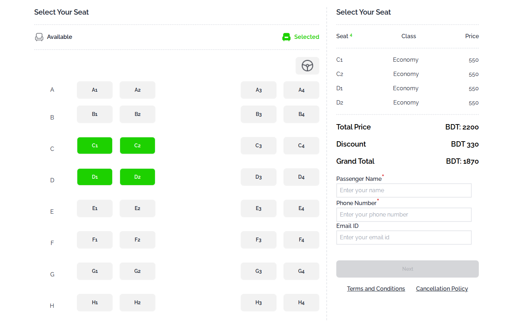

# NEXUS Travels — Bus Ticket Booking

A responsive bus-ticketing website with a working seat-booking flow: choose up to four seats, apply a coupon and confirm the trip. It's built with Tailwind CSS and plain JavaScript, with no framework.

[](https://shayan-abrar.github.io/NEXUS-TRAVELS-TICKETING-with-js/) <!-- live-demo -->


## Overview

NEXUS Travels is a single-page front end for booking seats on the *Nexus Express* coach (Dhaka → Sylhet, AC business class, BDT 550 per seat). It pairs a marketing landing page (hero, key stats and coupon offers) with a booking widget. All the state, pricing and validation logic uses DOM APIs directly.

## Features

- **Interactive seat map:** 40 seats in rows A–J. Selected seats turn green, lock, and update the *seats left* counter.
- **Booking limit:** up to four seats per booking, enforced with an alert.
- **Live fare summary:** each selected seat is listed with its class and fare, and the total and grand total recalculate instantly.
- **Coupon codes:** `NEW15` gives 15% off and `Couple 20` gives 20% off. The *Apply* button unlocks once four seats are selected, and invalid codes are rejected.
- **Passenger form:** name, phone and email fields. *Next* is enabled only after at least one seat is selected and a phone number is entered.
- **Confirmation modal:** a DaisyUI modal confirms the booking.
- **Responsive layout** built with Tailwind CSS utilities.



## Tech Stack

| Layer | Technology |
| --- | --- |
| Markup | HTML5 |
| Styling | Tailwind CSS (Play CDN), DaisyUI 4, Google Fonts (Raleway) |
| Logic | Vanilla JavaScript (DOM APIs, event listeners) |
| Hosting | GitHub Pages |

## Project Structure

```text
NEXUS-TRAVELS-TICKETING-with-js/
├── index.html          # Landing page and booking section
├── script.js           # Seat selection, fare totals, coupons, form checks
├── utility.js          # Small DOM helper functions
├── style.css           # Custom fonts and hero background
├── tailwind.config.js
└── images/             # Icons, banner and illustrations
```

## Run Locally

```bash
git clone https://github.com/SHAYAN-ABRAR/NEXUS-TRAVELS-TICKETING-with-js.git
cd NEXUS-TRAVELS-TICKETING-with-js
# Open index.html in a browser, or serve the folder with VS Code Live Server
```

There's no build step. Tailwind CSS and DaisyUI load from their CDNs, so you need an internet connection.

## How It Works

1. Clicking a seat adds a row to the fare summary, disables that seat and lowers the seats-left count.
2. The total is recalculated from the per-seat fare. Once four seats are selected, the coupon field unlocks.
3. A valid coupon calculates the discount, updates the grand total and hides the coupon input.
4. Typing a phone number enables **Next**, which opens the confirmation modal.

## What I Learned

- Managing UI state (counters, totals, disabled buttons) without a framework
- Breaking DOM logic into small, reusable helper functions
- Building responsive layouts quickly with Tailwind CSS and DaisyUI components

## Author

**Shayan Abrar** · [GitHub](https://github.com/SHAYAN-ABRAR) · [LinkedIn](https://www.linkedin.com/in/shayan-abrar/) · [Portfolio](https://shayan-abrar.vercel.app)
