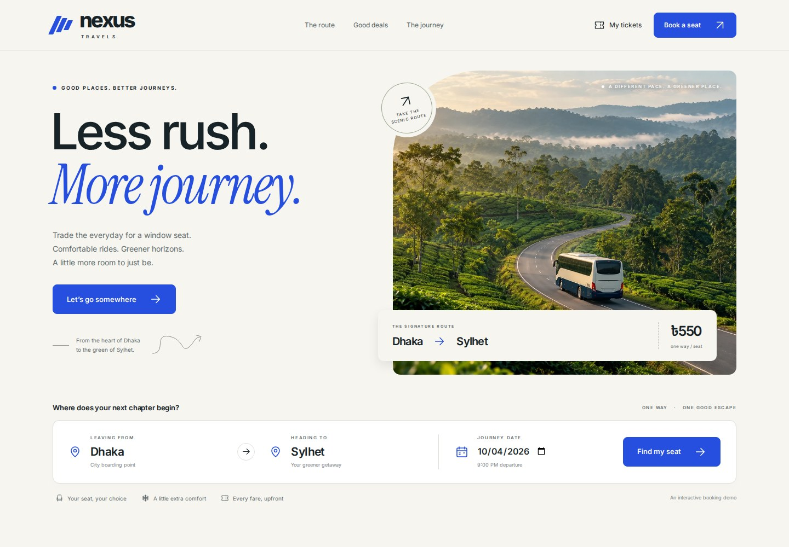
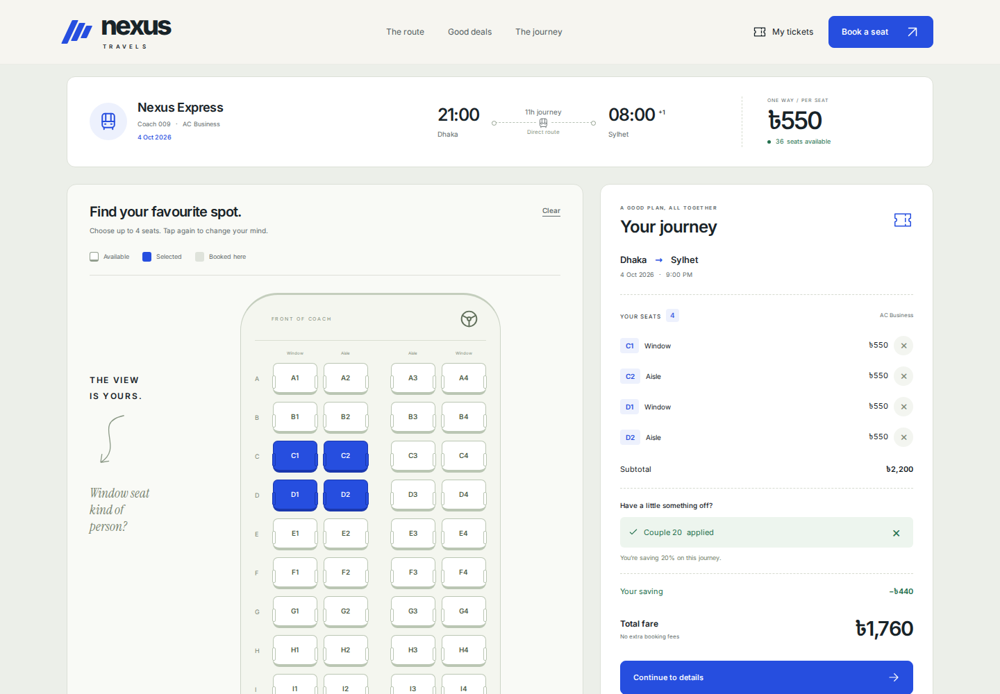

# Nexus Travels

**Less rush. More journey.** A responsive, browser-only bus booking demo for the Dhaka–Sylhet route, designed and built for Shayan Abrar.

[Live website](https://shayan-abrar.github.io/NEXUS-TRAVELS-TICKETING-with-js/) · [Booking preview](screenshots/booking.png) · [Mobile preview](screenshots/mobile.jpg)



## The experience

- A complete visual redesign: ivory backgrounds, blue accents, local Inter and Instrument Serif fonts, bespoke seat controls, and two AI-generated campaign photographs.
- One Dhaka–Sylhet route, coach 009, AC Business class, 9:00 PM departure and a sample next-day 8:00 AM arrival.
- A journey date picker that uses Bangladesh time, allows dates within the next 90 days, and prevents selecting an already-departed same-day service.
- All 40 original seats, rows A–J, with a maximum of four per booking. Select, deselect, remove individual seats, or clear the selection.
- The original BDT 550 fare. Four seats unlock **NEW15** (15% off) or **Couple 20** (20% off). Codes tolerate casing and spaces; only one applies at a time. Removing a seat removes an ineligible discount.
- Live fare totals, a sticky desktop booking summary, and a mobile total bar.
- Required name and Bangladesh mobile-number validation, with optional email. Both `01XXXXXXXXX` and `+8801XXXXXXXXX` work, including Bengali digits.
- A clear confirmation dialog, local **My tickets**, text-ticket downloads, and removable demo tickets.
- Draft date, seat and applied-coupon recovery after refreshing, when browser storage is available. Booked seats are tracked per date on this browser. Tabs reconcile local ticket changes.
- Working mobile navigation, FAQs, booking terms, cancellation information, and privacy controls.
- Keyboard seat navigation with arrow keys, Home and End; visible focus styles; live status messages; native modal dialogs; and reduced-motion support.



## Run locally

No dependency installation, build command, account, API key, or database is needed.

```powershell
git clone https://github.com/SHAYAN-ABRAR/NEXUS-TRAVELS-TICKETING-with-js.git
Set-Location NEXUS-TRAVELS-TICKETING-with-js
python -m http.server 8000
```

Open `http://localhost:8000`. On Linux/macOS use `python3`. The plain HTML, CSS and deferred JavaScript can also be previewed by opening `index.html` directly; use the local server to match website storage behavior more closely.

## GitHub Pages

Publish **main / (root)** using GitHub Pages. All asset paths are relative, so the repository subpath works without a build step. After merging a redesign branch, wait for the Pages deployment to finish in Actions, then refresh the live site. Use Ctrl+F5 if old assets remain cached.

See `START-HERE-WINDOWS.txt` for the supplied ZIP and PowerShell helper workflow. The package was prepared from main revision `7d9f7b062c4c491a05bfc363f67aa7ddb789f7f0`.

## Demo scope and privacy

This is a portfolio demonstration, not a live transport service. No payment is processed, no real ticket is issued, and no email is sent. The original route, fare and schedule remain sample information. The scenic photos are AI-generated illustrations, not documentary images of an operator or guaranteed views on the overnight service.

Local storage uses the `nexus-travels-v2` key. It stores the draft journey and demo tickets, including passenger name. **Phone and email are never persisted or included in downloads.** Tickets belong to this browser and origin; they do not synchronize between devices or browsers. Browser data clearing removes them. If storage is unavailable, booking still works for the current session and tickets can be downloaded. Separate-tab updates are reconciled, but local storage is not a server reservation system and cannot guarantee cross-tab atomic locking.

The page uses no analytics, trackers, CDN scripts, remote fonts, authentication, or payment integrations. Existing original image assets, the unreferenced `utility.js` and `tailwind.config.js`, and the legacy `screenshots/tour.gif` are retained for repository continuity. The current page loads only `style.css` and `script.js`; it no longer depends on Tailwind or DaisyUI.

## Files

| Path | Purpose |
| --- | --- |
| `index.html` | Landing page, booking form, dialogs and accessible content |
| `style.css` | Responsive design system and component styling |
| `script.js` | Seat, coupon, date, validation and local ticket behavior |
| `images/journey-*.webp` | Responsive hero image |
| `images/sylhet-*.webp` | Responsive destination image |
| `images/CAMPAIGN-IMAGES.md` | Image provenance and complete generation prompts |
| `assets/fonts/` | Local fonts, Bengali glyph support and OFL licenses |
| `screenshots/` | Current desktop/mobile previews; legacy tour retained |
| `DESIGN_REVIEW.md` | Changes, preserved behavior and verification record |

## Verification

22 Chromium browser checks passed, including pricing, both coupons, required fields, ticket persistence and deletion, date handling, corrupt/blocked storage, HTML-safe passenger names, keyboard interactions, and a complete mobile booking. No horizontal overflow at widths from 320 to 1920 pixels. The repository subpath was tested with no page errors, failed assets, or external network dependencies.

See `DESIGN_REVIEW.md` for the complete verification record. Other browser engines and the Windows publishing helper were not executed in this Linux environment.

## License

The original repository does not declare a project-wide license. This redesign does not add one. Please ask Shayan Abrar before reusing repository code or assets. Included font licenses are in `assets/fonts/`. AI campaign-image provenance is documented separately.

Built by **Shayan Abrar** · [GitHub](https://github.com/SHAYAN-ABRAR) · [LinkedIn](https://www.linkedin.com/in/shayan-abrar/)
